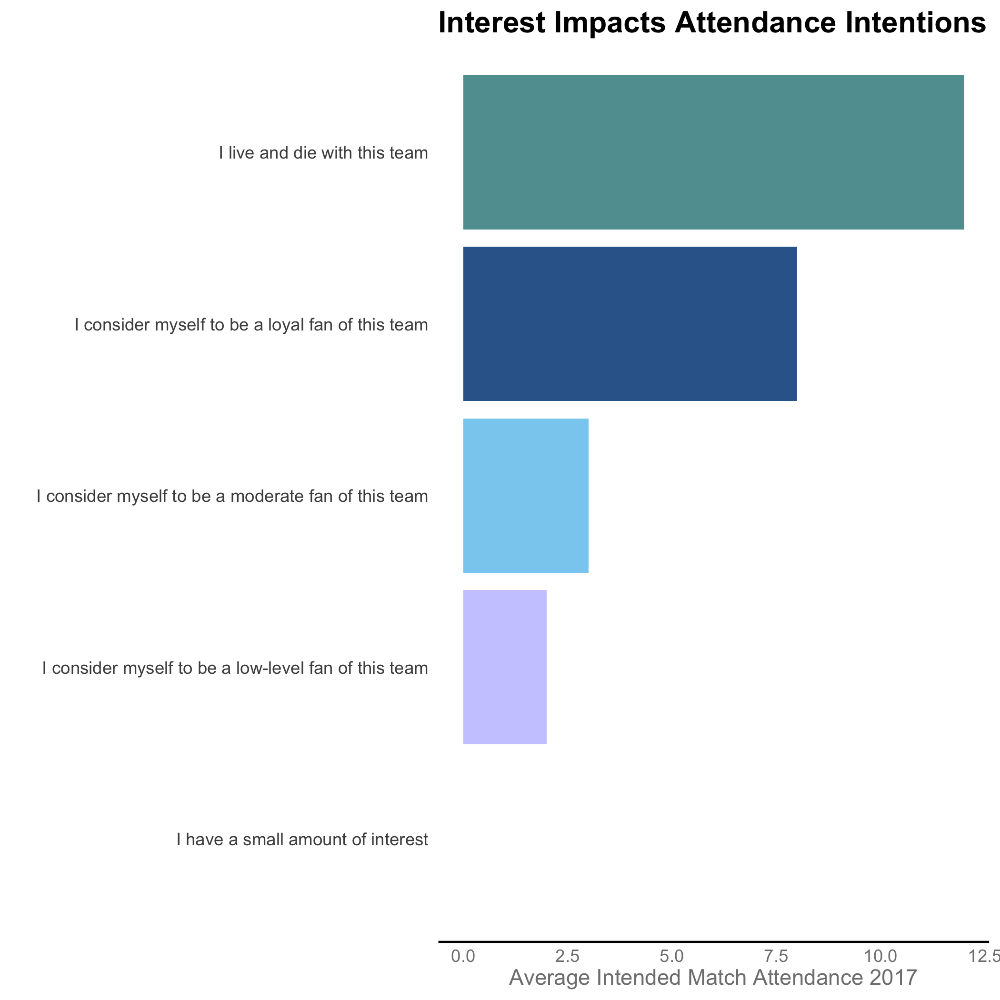
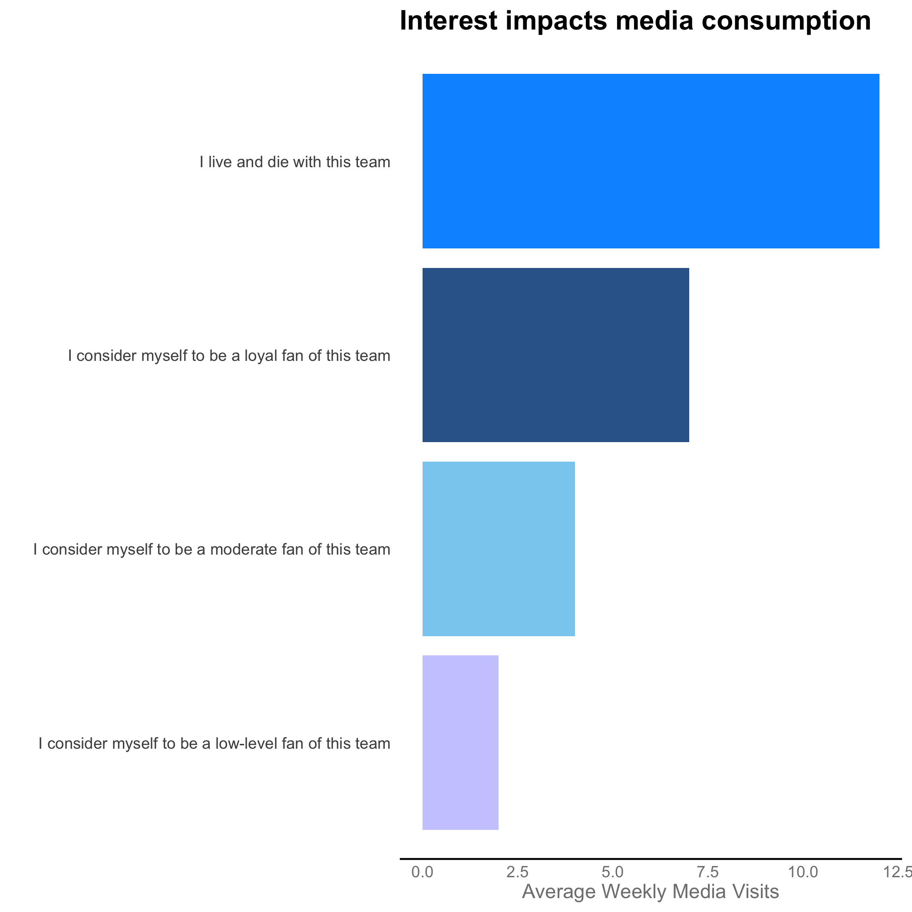
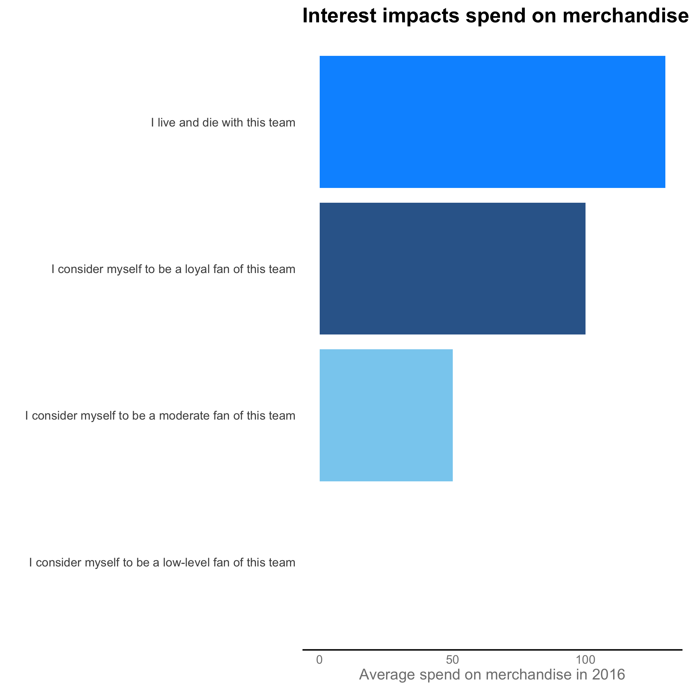

#### **To: Reign FC**  
  
#### **From: Jennifer Grosz**  
  
#### **Date: 08/28/2021**   
  
#### **RE: Attendance, Media, and Merchandise Intentions**  

***
```{r include = FALSE}
# Set chunk options for the file
knitr::opts_chunk$set(echo = FALSE, message = FALSE, warning = FALSE)

```

```{r}
# Course: 5210 Data Visualization
# Purpose: Memo - QP1
# Date: July 8, 2021
# Author: Jennifer Grosz
```

```{r}
# Clear environment of variables and functions
rm(list = ls(all = TRUE)) 

# Clear environmet of packages
if(is.null(sessionInfo()$otherPkgs) == FALSE)lapply(paste("package:", names(sessionInfo()$otherPkgs), sep=""), detach, character.only = TRUE, unload = TRUE)

```

```{r}
# Load librarys
library(tidyverse)
library(scales) # use for rounding numbers
library(kableExtra) # use for table outputs
```


The data set used for this analysis contains 684 observations and consists of 251 variables. It was extracted from responses to a survey distributed online through the mailing list provided by your organization. The survey I created covers a combination of past attendance behaviors, behavior intentions, psychographics, and demographics. This analysis isn’t just about helping you understand attendees of Reign FC matches. It’s about providing you with business intelligence and key market insights that will enable you better connect with Reign fans at the right times. 

I focused my efforts on identifying what factors impact attendance intentions, media consumption intentions, and merchandise consumption intentions. I’ve come up with the following findings to share with you.

{width=500px}

As shown in the plot above, higher levels of interest reliably increase the number of matches a fan plans to in 2017. Additionally, the number of matches a fan attended in 2016 impacts the numer of matches they plan to attend in 2017. Furthermore, the ticket type a fan plans to use in 2017 also impacts intended match attendance. Season ticket users reliably plan to attend more matches than single match ticket users and 5 match pack ticket users. 

{width=500px}

Interest also reliably impacts media consumption. Increasing levels of interest reliably have higher media engagement behaviors. Also, I found that being a 'real fan' impacts media consumption along with being a fan of Coach Laura Harvy. Both reliably increase average weekly media platform visits.


{width=500px}

The plot above who now increasing levels of being a interest reliably impact merchandise spend. I also found the number of matches a fan attended in 2016 impact average spend on merchandise products. By the same token, the ticket type a fan plans to use in 2017 also impacts merchandise spend. Season ticket users reliably spend more than single match ticket users.

I have a number of other insights similar to what I've provided above pertaining to the primary factors that impact Reign fan's season outcome satisfaction, performance satisfaction, match day satisfaction and brand attitude. I would love the opportunity those insights and more with you if you're open to hearing them. In the meantime, please let me know if you have any questions or would like to discuss any part of this analysis in greater detail. You can reach me at groszj@seattleu.edu. I can also send over the Technical Appendix with my complete analysis and the data if you would like more information, feel free to let me know!

Sincerely,
Jenni